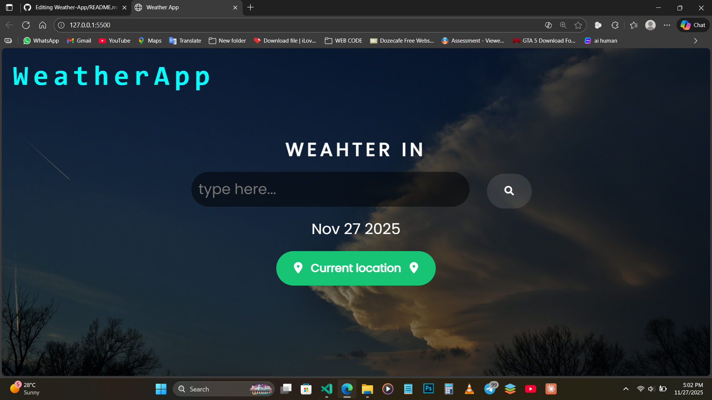

🌦️ Weather App

A simple and beautiful Weather App that lets you check real-time weather conditions for any city in the world. Built with a clean UI and fast performance.

✨ Features

🔍 Search by city name

⏱️ Real-time weather data

🌡️ Temperature, humidity, wind speed, and more

🎨 Modern and responsive UI

📍 Location-based weather (optional)

🛠️ Tech Stack
Frontend: HTML, CSS, JavaScript

API: OpenWeatherMap API

📸 Preview

 
 Run the app
Simply open index.html in your browser.

📂 Project Structure
weather-app/
├── index.html
├── style.css
├── script.js
├── assets/
└── README.md

🧩 API Used
🌐 OpenWeatherMap — https://openweathermap.org/

🗺️ Future Improvements

🌙 Dark mode

📱 PWA installation

🔔 Weather alerts
